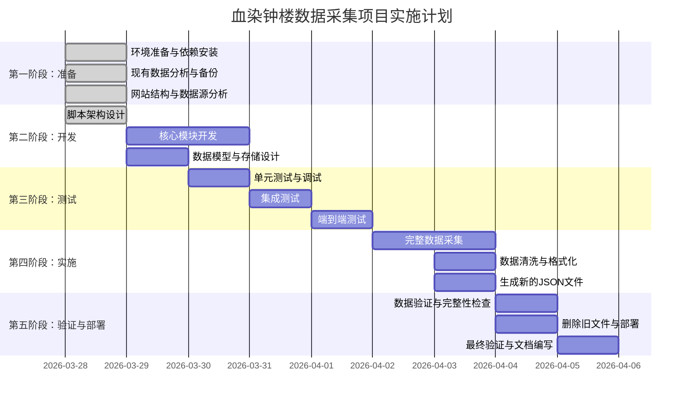

# 完整实施计划

## 项目概述
重新采集血染钟楼官方Wiki的所有数据，替换当前被篡改的JSON文件，确保数据准确性和完整性。

## 实施时间线



## 详细实施步骤

### 步骤1：环境准备（已完成）
- [x] 确认Python 3.8+环境
- [x] 安装必要依赖包：requests, beautifulsoup4, lxml
- [x] 创建项目目录结构
- [x] 备份现有JSON文件到 `json/backup/` 目录

### 步骤2：脚本开发
1. **基于现有脚本改进**
   - 复制 `json/spider-通用- 副本.py` 到 `scripts/wiki_spider_v2.py`
   - 重构为模块化设计
   - 添加错误处理和日志系统

2. **实现核心功能模块**
   - 页面获取和解析模块
   - 数据提取和结构化模块
   - 链接发现和队列管理模块
   - 数据存储和序列化模块

3. **配置管理**
   - 创建配置文件 `config/spider_config.yaml`
   - 实现可配置的采集参数
   - 添加环境变量支持

### 步骤3：测试验证
1. **单元测试**
   - 测试单个角色页面解析
   - 测试页面类型检测
   - 测试数据提取准确性

2. **集成测试**
   - 测试链接发现功能
   - 测试队列管理
   - 测试数据存储

3. **端到端测试**
   - 小规模采集测试（10-20个页面）
   - 验证数据质量
   - 性能测试

### 步骤4：完整数据采集
1. **启动采集任务**
   ```bash
   python scripts/wiki_spider_v2.py --start-urls config/start_urls.txt --max-pages 1000
   ```

2. **监控采集过程**
   - 实时查看日志文件
   - 监控内存和CPU使用
   - 记录采集进度和统计

3. **处理异常情况**
   - 网络中断重试
   - 页面解析失败处理
   - 数据存储异常处理

### 步骤5：数据后处理
1. **数据清洗**
   - 去除重复数据
   - 填充缺失字段
   - 标准化数据格式

2. **数据验证**
   - 检查字段完整性
   - 验证数据一致性
   - 对比现有数据质量

3. **生成JSON文件**
   - 按类型分组存储
   - 生成完整的角色列表
   - 创建剧本和规则文件

### 步骤6：文件替换
1. **备份旧文件**
   ```bash
   # 备份当前json文件夹
   cp -r json/ json_backup_$(date +%Y%m%d)/
   ```

2. **删除被篡改的文件**
   ```bash
   # 删除现有JSON文件（保留备份）
   rm -f json/*.json
   ```

3. **部署新文件**
   ```bash
   # 复制新生成的JSON文件
   cp -r json/official/* json/
   ```

### 步骤7：最终验证
1. **功能验证**
   - 测试现有系统能否读取新JSON文件
   - 验证数据在应用中的表现
   - 检查是否有兼容性问题

2. **完整性验证**
   - 统计角色数量是否完整
   - 检查剧本信息是否齐全
   - 验证规则数据准确性

## 实施风险与应对措施

### 技术风险
| 风险 | 概率 | 影响 | 应对措施 |
|------|------|------|----------|
| 网站反爬虫机制 | 中 | 高 | 设置合理延迟，使用代理轮换 |
| 页面结构变化 | 低 | 高 | 实现灵活的解析策略，定期更新 |
| 网络不稳定 | 中 | 中 | 实现重试机制，断点续传 |
| 数据量过大 | 低 | 中 | 分批采集，优化存储结构 |

### 项目风险
| 风险 | 概率 | 影响 | 应对措施 |
|------|------|------|----------|
| 时间超出预期 | 中 | 中 | 设置里程碑，定期检查进度 |
| 数据质量不达标 | 低 | 高 | 建立严格的测试验证流程 |
| 系统兼容性问题 | 低 | 高 | 保留旧数据备份，逐步迁移 |

## 资源需求

### 人力资源
- **开发人员**：1人（负责脚本开发和测试）
- **测试人员**：1人（负责数据验证和质量检查）
- **项目负责人**：1人（负责协调和决策）

### 技术资源
- **开发环境**：Python 3.8+，VS Code，Git
- **测试环境**：独立的测试服务器或虚拟机
- **存储空间**：预计需要 100MB-500MB 存储空间

### 时间资源
- **总工期**：7-10个工作日
- **关键路径**：脚本开发 → 完整采集 → 数据验证

## 质量保证措施

### 代码质量
1. **代码审查**
   - 所有代码必须经过审查
   - 遵循PEP 8编码规范
   - 添加必要的注释和文档

2. **测试覆盖**
   - 单元测试覆盖核心功能
   - 集成测试覆盖主要流程
   - 端到端测试验证完整功能

### 数据质量
1. **验证标准**
   - 字段完整率 > 95%
   - 数据准确率 > 98%
   - 格式一致率 100%

2. **检查清单**
   - [ ] 所有角色页面都被采集
   - [ ] 角色类型正确识别
   - [ ] 英文名称准确提取
   - [ ] 内容结构化正确
   - [ ] 元数据完整

### 文档质量
1. **技术文档**
   - 脚本使用说明
   - 数据格式说明
   - 故障排除指南

2. **用户文档**
   - 数据更新流程
   - 验证方法
   - 常见问题解答

## 验收标准

### 基本验收标准（必须满足）
1. 脚本能成功采集所有Wiki页面
2. 生成的JSON文件可被现有系统读取
3. 数据字段完整率 > 95%
4. 无重大性能问题或内存泄漏
5. 错误处理机制完善

### 高级验收标准（建议满足）
1. 支持断点续传功能
2. 有完整的监控和日志系统
3. 配置灵活，易于调整
4. 代码结构清晰，易于维护
5. 文档完整，易于理解

### 优化目标
1. 采集速度优化：< 2秒/页面
2. 内存使用优化：< 500MB
3. 代码可维护性：模块化设计
4. 用户体验：清晰的进度反馈

## 交付物清单

### 主要交付物
1. **Python采集脚本** (`scripts/wiki_spider_v2.py`)
2. **配置文件** (`config/spider_config.yaml`)
3. **新的JSON数据文件** (`json/official/` 目录)
4. **测试报告** (`reports/test_report.md`)
5. **用户手册** (`docs/user_manual.md`)

### 辅助交付物
1. **日志文件** (`logs/wiki_spider.log`)
2. **备份文件** (`json/backup/` 目录)
3. **原始数据** (`json/raw/` 目录)
4. **测试数据** (`tests/test_data/` 目录)

### 文档交付物
1. **技术设计文档** (`docs/technical_design.md`)
2. **实施计划文档** (`plans/完整实施计划.md`)
3. **测试计划文档** (`plans/测试验证计划.md`)
4. **部署指南** (`docs/deployment_guide.md`)

## 沟通计划

### 定期汇报
- **每日站会**：讨论进展、问题和计划
- **每周总结**：总结本周进展，规划下周工作
- **里程碑汇报**：每个阶段完成后的正式汇报

### 沟通渠道
- **即时通讯**：日常沟通和问题讨论
- **项目管理工具**：任务跟踪和进度管理
- **文档共享**：技术文档和报告共享

### 决策机制
- **技术决策**：由开发团队讨论决定
- **项目决策**：由项目负责人决定
- **重大变更**：需要所有相关方同意

## 成功标准

### 项目成功标准
1. **按时完成**：在计划时间内完成所有任务
2. **预算控制**：在预算范围内完成项目
3. **质量达标**：所有验收标准都满足
4. **用户满意**：最终用户对结果满意

### 技术成功标准
1. **功能完整**：所有计划功能都实现
2. **性能良好**：系统性能满足要求
3. **稳定可靠**：系统稳定运行，无明显缺陷
4. **易于维护**：代码结构清晰，易于维护和扩展

### 业务成功标准
1. **数据准确**：采集的数据准确无误
2. **系统兼容**：新数据与现有系统兼容
3. **流程优化**：数据更新流程得到优化
4. **风险降低**：降低了数据被篡改的风险

## 后续维护计划

### 定期更新
1. **数据更新**：每季度或半年更新一次数据
2. **脚本维护**：根据Wiki变化更新解析规则
3. **系统升级**：随Python版本升级更新依赖

### 监控和告警
1. **数据监控**：监控数据完整性和准确性
2. **系统监控**：监控脚本运行状态和性能
3. **告警机制**：异常情况自动告警

### 改进计划
1. **性能优化**：持续优化采集速度和资源使用
2. **功能增强**：根据需求添加新功能
3. **用户体验**：改进使用体验和文档

## 应急计划

### 问题处理流程
1. **识别问题**：通过监控或用户反馈发现问题
2. **分析原因**：分析问题根本原因
3. **制定方案**：制定解决方案
4. **实施修复**：实施修复措施
5. **验证效果**：验证修复效果

### 回滚计划
如果新数据导致系统问题，执行以下步骤：
1. 立即停止使用新数据
2. 恢复备份的旧数据
3. 分析问题原因
4. 修复问题后重新部署

### 数据恢复
如果数据损坏或丢失，执行以下步骤：
1. 从备份恢复数据
2. 重新运行采集脚本
3. 验证数据完整性
4. 更新系统状态