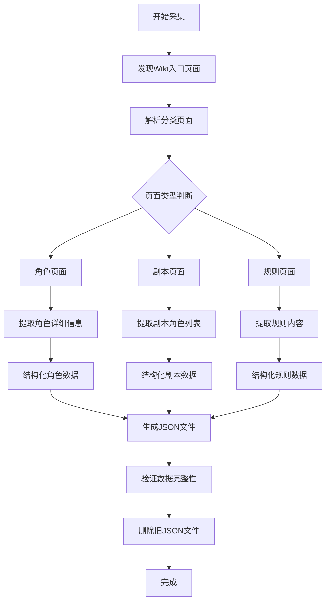

# 血染钟楼Wiki数据采集架构

## 目标
从官方Wiki https://clocktower-wiki.gstonegames.com 采集所有角色信息、规则信息和剧本信息，生成新的JSON文件，替换现有被篡改的JSON文件。

## 数据采集范围

### 1. 角色数据
- **所有镇民** (Townsfolk)
- **所有外来者** (Outsiders) 
- **所有爪牙** (Minions)
- **所有恶魔** (Demons)
- **所有传奇角色** (Legends)
- **所有旅行者** (Travellers)

### 2. 剧本数据
- **黯月初升** (Sects & Violets)
- **梦殒春宵** (Bad Moon Rising)
- **暗流涌动** (Trouble Brewing)
- **其他剧本** (如华灯初上等)

### 3. 规则数据
- **夜晚行动顺序** (Night Order)
- **游戏简要规则** (Game Rules)
- **相克规则** (Jinx Rules)
- **重要细节** (Important Details)

## 数据采集流程



## 数据存储结构设计

### 1. 统一角色数据结构
```json
{
  "id": "唯一标识",
  "name": "角色名称",
  "english_name": "英文名称",
  "type": "角色类型",
  "script": "所属剧本",
  "url": "Wiki页面URL",
  "content": {
    "background": "背景故事",
    "ability": "角色能力",
    "description": "角色简介",
    "examples": ["范例1", "范例2"],
    "operation": "运作方式",
    "hints": "提示与技巧",
    "disguise": "伪装技巧",
    "rules": "规则细节",
    "markers": "提示标记"
  },
  "metadata": {
    "first_night": "首夜是否行动",
    "other_nights": "其他夜晚是否行动",
    "reminders": "需要提示标记",
    "jinxes": ["相克角色列表"]
  }
}
```

### 2. 剧本数据结构
```json
{
  "script_id": "剧本ID",
  "name": "剧本名称",
  "english_name": "英文名称",
  "min_players": "最小玩家数",
  "recommended_players": "推荐玩家数",
  "description": "剧本描述",
  "townsfolk": ["镇民角色列表"],
  "outsiders": ["外来者角色列表"],
  "minions": ["爪牙角色列表"],
  "demons": ["恶魔角色列表"],
  "travellers": ["旅行者角色列表"],
  "experimental": ["实验性角色列表"],
  "night_order": {
    "first_night": "首夜顺序",
    "other_nights": "其他夜晚顺序"
  }
}
```

### 3. 规则数据结构
```json
{
  "night_order": {
    "title": "夜晚行动顺序",
    "content": "详细的夜晚行动顺序表",
    "notes": "注意事项",
    "characters": ["涉及的角色顺序"]
  },
  "game_rules": {
    "title": "游戏简要规则",
    "sections": [
      {
        "title": "章节标题",
        "content": "章节内容"
      }
    ]
  },
  "jinx_rules": {
    "title": "相克规则",
    "jinxes": [
      {
        "character_a": "角色A",
        "character_b": "角色B",
        "description": "相克效果描述"
      }
    ]
  }
}
```

## 采集策略设计

### 1. 页面发现策略
- **入口页面**: 从首页开始，抓取所有分类链接
- **角色发现**: 通过"所有角色"、"镇民列表"、"外来者列表"等分类页面
- **剧本发现**: 通过"剧本"、"扩展包"等分类
- **规则发现**: 通过"规则"、"夜晚顺序"等特定页面

### 2. 内容提取策略
- **HTML解析**: 使用BeautifulSoup解析MediaWiki页面结构
- **模板识别**: 识别Wiki模板格式，如infobox、角色信息框
- **章节提取**: 按标题层级提取结构化内容
- **文本清洗**: 去除无关标记、广告、导航栏等

### 3. 数据验证策略
- **完整性检查**: 确保必需字段不为空
- **一致性检查**: 角色引用关系的一致性
- **去重处理**: 避免重复采集同一页面
- **版本控制**: 记录采集时间戳和页面版本

## 文件输出规划

### 新JSON文件结构
```
json/official/
├── characters/
│   ├── all_characters.json          # 所有角色完整信息
│   ├── townsfolk.json               # 镇民分类
│   ├── outsiders.json               # 外来者分类
│   ├── minions.json                 # 爪牙分类
│   ├── demons.json                  # 恶魔分类
│   └── legends.json                 # 传奇角色分类
├── scripts/
│   ├── trouble_brewing.json         # 暗流涌动
│   ├── sects_violets.json           # 黯月初升
│   ├── bad_moon_rising.json         # 梦殒春宵
│   └── other_scripts.json           # 其他剧本
└── rules/
    ├── night_order.json             # 夜晚行动顺序
    ├── game_rules.json              # 游戏简要规则
    ├── jinx_rules.json              # 相克规则
    ├── important_details.json       # 重要细节
    └── complete_rules.json          # 完整规则集合
```

### 备份策略
- 在删除旧文件前备份到 `json/backup/` 目录
- 保留原始采集数据在 `json/raw/` 目录
- 生成采集日志和错误报告

## 实施步骤

1. **开发核心采集引擎**
   - 基于现有Python脚本改进
   - 添加页面发现和分类功能
   - 实现结构化数据提取

2. **测试采集流程**
   - 小规模测试单个角色页面
   - 测试分类页面解析
   - 验证数据提取准确性

3. **完整数据采集**
   - 执行全站爬取
   - 处理分页和链接发现
   - 处理异常和重试机制

4. **数据后处理**
   - 数据清洗和格式化
   - 生成JSON文件
   - 验证数据完整性

5. **文件替换**
   - 备份旧JSON文件
   - 删除被篡改的文件
   - 部署新JSON文件

## 技术栈
- **Python 3.x**: 主要编程语言
- **Requests**: HTTP请求库
- **BeautifulSoup4**: HTML解析库
- **json**: 数据序列化
- **多线程/异步**: 提高采集效率
- **日志系统**: 记录采集过程

## 风险管理
- **反爬虫机制**: 添加请求间隔、User-Agent轮换
- **网络波动**: 实现重试机制和连接超时处理
- **数据变更**: 定期更新采集，版本控制
- **存储空间**: 合理管理采集的中间数据和最终文件