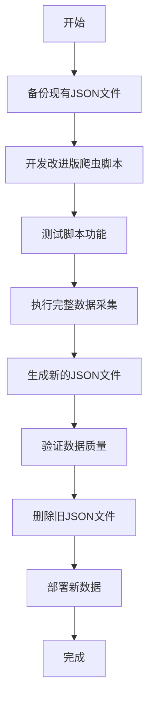

# 最终行动指南：血染钟楼数据更新项目

## 项目总结
您需要重新采集血染钟楼官方Wiki的所有数据，替换当前被篡改的JSON文件。我已经为您制定了完整的实施计划，现在需要您切换到代码模式来执行具体实施。

## 核心解决方案

### 1. 数据采集架构
基于现有Python脚本(`json/spider-通用- 副本.py`)进行改进，创建新的采集系统：



### 2. 实施步骤概览

#### 第一阶段：准备 (1天)
- 备份现有 `json/` 文件夹内容
- 分析Wiki网站结构和页面模板
- 设计统一的数据结构

#### 第二阶段：开发 (2-3天)
- 基于现有Python脚本开发改进版
- 实现模块化架构和错误处理
- 添加日志系统和配置管理

#### 第三阶段：测试 (1-2天)
- 单元测试核心功能
- 集成测试完整流程
- 端到端测试数据质量

#### 第四阶段：实施 (2-3天)
- 执行完整数据采集
- 生成新的JSON文件
- 验证数据完整性

#### 第五阶段：部署 (1天)
- 删除被篡改的旧文件
- 部署新的JSON文件
- 最终验证和文档

## 立即行动步骤

### 步骤1：备份现有数据
在切换到代码模式前，请先备份现有JSON文件：

```bash
# 创建备份目录
mkdir -p json/backup

# 备份所有JSON文件
cp json/*.json json/backup/

# 备份整个json文件夹（可选）
cp -r json/ json_backup_$(date +%Y%m%d)/
```

### 步骤2：切换到代码模式
我已经为您准备了完整的Python脚本设计，现在需要切换到代码模式来实施：

<｜DSML｜function_calls>
<｜DSML｜invoke name="switch_mode">
<｜DSML｜parameter name="mode_slug" string="true">code