# 血染钟楼辅助工具项目结构分析报告

## 项目概述

**项目名称**: clocktower-helper (血染钟楼辅助工具)  
**项目类型**: Next.js 15 + React 19 + TypeScript 桌面端Web应用  
**主要功能**: 血染钟楼桌游说书人辅助工具，支持多剧本、多角色、完整游戏流程管理  

## 技术栈

### 前端框架
- **Next.js 15.1.6** (App Router)
- **React 19.2.0**
- **TypeScript 5**

### 样式与UI
- **Tailwind CSS 4** (PostCSS)
- **Framer Motion 11.11.17** (动画)
- **CLSX** (条件类名)

### 开发工具
- **Biome** (格式化与linting)
- **ESLint** (代码检查)
- **Vitest + Jest** (单元测试)
- **Playwright** (E2E测试)
- **Madge** (循环依赖检查)

### 构建与部署
- **SWC** (编译)
- **Vercel** (部署目标，基于Next.js)

## 项目结构

### 核心目录架构

```mermaid
graph TB
    ROOT[项目根目录] --> APP[app/ Next.js App Router]
    ROOT --> SRC[src/ 业务逻辑]
    ROOT --> TESTS[tests/ 测试]
    ROOT --> JSON[json/ 游戏数据]
    
    APP --> LAYOUT[layout.tsx 根布局]
    APP --> PAGE[page.tsx 主页面]
    APP --> GLOBALS[globals.css 全局样式]
    APP --> GAMELOGIC[gameLogic.ts 游戏逻辑]
    
    SRC --> COMPONENTS[components/ 组件]
    SRC --> ROLES[roles/ 角色定义]
    SRC --> HOOKS[hooks/ React Hooks]
    SRC --> CONTEXTS[contexts/ React Context]
    SRC --> UTILS[utils/ 工具函数]
    SRC --> TYPES[types/ TypeScript类型]
    SRC --> DATA[data/ 静态数据]
    
    COMPONENTS --> GAME[game/ 游戏组件]
    COMPONENTS --> MODALS[modals/ 模态框]
    COMPONENTS --> LAYOUT[layout/ 布局组件]
    COMPONENTS --> COMMON[common/ 通用组件]
    
    ROLES --> TOWNSFOLK[townsfolk/ 镇民]
    ROLES --> OUTSIDER[outsider/ 外来者]
    ROLES --> MINION[minion/ 爪牙]
    ROLES --> DEMON[demon/ 恶魔]
    ROLES --> NEW_ENGINE[new_engine/ 新引擎]
    ROLES --> CORE[core/ 核心类型]
    
    HOOKS --> USEGAMECONTROLLER[useGameController.ts 游戏控制器]
    HOOKS --> USENIGHTACTIONHANDLER[useNightActionHandler.ts 夜晚行动]
    HOOKS --> USEGAMESTATE[useGameState.ts 游戏状态]
    
    UTILS --> NIGHTENGINEFACADE[nightEngineFacade.ts 夜晚引擎门面]
    UTILS --> NIGHTLOGIC[nightLogic.ts 夜晚逻辑]
    UTILS --> GAMEEVENTBUS[gameEventBus.ts 事件总线]
```



### 详细目录说明

#### 1. `app/` - Next.js App Router
- `layout.tsx` - 应用根布局，包含GameContext和AudioProvider
- `page.tsx` - 主页面组件，游戏核心逻辑容器
- `globals.css` - 全局Tailwind样式
- `gameLogic.ts` - 游戏逻辑核心（可能已迁移到src）
- `data.ts` - 页面数据

#### 2. `src/` - 业务逻辑源代码
- **`components/`** - React组件
  - `game/` - 游戏相关组件（GameBoard, GameStage, GameLayout等）
  - `modals/` - 模态对话框（50+个角色相关模态框）
  - `layout/` - 布局组件（ScaleLayout等）
  - `common/` - 通用组件
  
- **`roles/`** - 游戏角色定义（200+个角色）
  - `townsfolk/` - 镇民角色（savant.ts, artist.ts, dreamer.ts等）
  - `outsider/` - 外来者角色（drunk.ts, lunatic.ts, sweetheart.ts等）
  - `minion/` - 爪牙角色（poisoner.ts, spy.ts, witch.ts等）
  - `demon/` - 恶魔角色（imp.ts, vortox.ts, vigormortis.ts等）
  - `new_engine/` - 新引擎角色定义（基于能力的实现）
  - `core/` - 角色核心类型定义
  - `unifiedRoleDefinition.ts` - 统一角色定义

- **`hooks/`** - 自定义React Hooks
  - `useGameController.ts` - 游戏主控制器（状态管理核心）
  - `useGameState.ts` - 游戏状态管理
  - `useNightActionHandler.ts` - 夜晚行动处理
  - `useGameFlow.ts` - 游戏流程控制
  - `useNightEngine.ts` - 夜晚引擎
  - 其他20+个专用Hook

- **`contexts/`** - React Context
  - `GameContext.tsx` - 游戏全局状态上下文
  - `GameActionsContext.tsx` - 游戏操作上下文

- **`utils/`** - 工具函数
  - `nightEngineFacade.ts` - 夜晚引擎门面模式
  - `nightLogic.ts` - 夜晚逻辑计算
  - `gameEventBus.ts` - 游戏事件总线
  - `nightStateMachine.ts` - 夜晚状态机
  - `middlewarePipeline.ts` - 中间件管道
  - 其他20+个工具模块

- **`types/`** - TypeScript类型定义
  - `game.ts` - 游戏核心类型
  - `roleDefinition.ts` - 角色定义类型
  - `modal.ts` - 模态框类型
  - `registration.ts` - 注册类型

- **`data/`** - 静态数据
  - `rolesData.json` - 角色数据
  - `jinxes.json` - 相克规则
  - `nightOrder.json` - 夜晚行动顺序
  - `officialRoleDocs.json` - 官方角色文档

#### 3. `tests/` - 测试套件
- `comprehensive_simulation.ts` - 综合模拟测试
- `e2e_scenario_tb.spec.ts` - 端到端测试
- `integration_simulation.spec.ts` - 集成测试
- `targeted_role_test.spec.ts` - 角色专项测试

#### 4. `json/` - JSON数据文件
- 游戏规则、角色文档、夜晚顺序等原始数据

#### 5. `scripts/` - 构建和数据处理脚本
- `generateOfficialData.js` - 官方数据生成
- `parse_night_order.js` - 夜晚顺序解析
- `cleanup_jinxes.js` - 相克规则清理

## 核心架构特点

### 1. 状态管理架构
- **React Context + Custom Hooks** 模式
- `GameContext` 提供全局状态
- `GameActionsContext` 提供操作函数
- `useGameController` 作为主控制器协调所有逻辑

### 2. 夜晚行动系统
- **夜晚引擎门面模式** (`nightEngineFacade.ts`)
- **状态机驱动** (`nightStateMachine.ts`)
- **中间件管道** (`middlewarePipeline.ts`)
- **能力优先级系统** (`abilityPriorityMiddleware.ts`)

### 3. 角色系统
- **基于能力的角色定义** (新引擎)
- **统一角色接口** (`unifiedRoleDefinition.ts`)
- **按阵营分类** (镇民、外来者、爪牙、恶魔)
- **动态能力注册** (`abilityRegistry.ts`)

### 4. 游戏流程
- **多阶段流程**: 剧本选择 → 设置 → 首夜 → 白天 → 黄昏 → 夜晚 → 天亮报告 → 游戏结束
- **事件驱动**: 通过事件总线协调组件通信
- **历史记录**: 完整的游戏历史记录和回放支持

### 5. UI/UX设计
- **响应式设计**: 支持横竖屏切换
- **动画丰富**: Framer Motion实现平滑过渡
- **音频反馈**: 音效系统增强沉浸感
- **可访问性**: 考虑视觉和交互可访问性

## 构建和开发工作流

### 开发命令
```bash
npm run dev          # 开发服务器
npm run build        # 生产构建
npm run start        # 生产服务器
npm run check:all    # 完整检查 (格式化 + 类型检查 + 测试 + 循环依赖)
npm run test         # 单元测试
npm run test:e2e     # E2E测试
npm run fix          # 自动修复代码格式
npm run type         # TypeScript类型检查
npm run circular     # 循环依赖检查
```

### 代码质量保障
- **Biome格式化**: 统一代码风格
- **TypeScript严格模式**: 类型安全
- **ESLint规则**: 代码规范
- **测试覆盖率**: 单元测试 + E2E测试
- **循环依赖检查**: 防止模块循环引用

## 项目成熟度评估

### 优势
1. **架构清晰**: 模块化设计，职责分离明确
2. **代码质量高**: 类型安全，测试覆盖较全
3. **功能完整**: 支持血染钟楼核心游戏流程
4. **可扩展性好**: 新角色、新剧本易于添加
5. **用户体验优秀**: 响应式设计，交互流畅

### 潜在改进点
1. **性能优化**: 大型游戏状态可能影响性能
2. **文档完善**: 部分复杂逻辑缺乏文档
3. **国际化**: 目前主要支持中文
4. **移动端适配**: 虽然支持响应式，但移动端体验可优化

## 总结

这是一个成熟的血染钟楼桌游说书人辅助工具项目，采用现代Web技术栈，具有清晰的架构设计和良好的代码质量。项目结构合理，功能完整，适合进一步的功能扩展和性能优化。