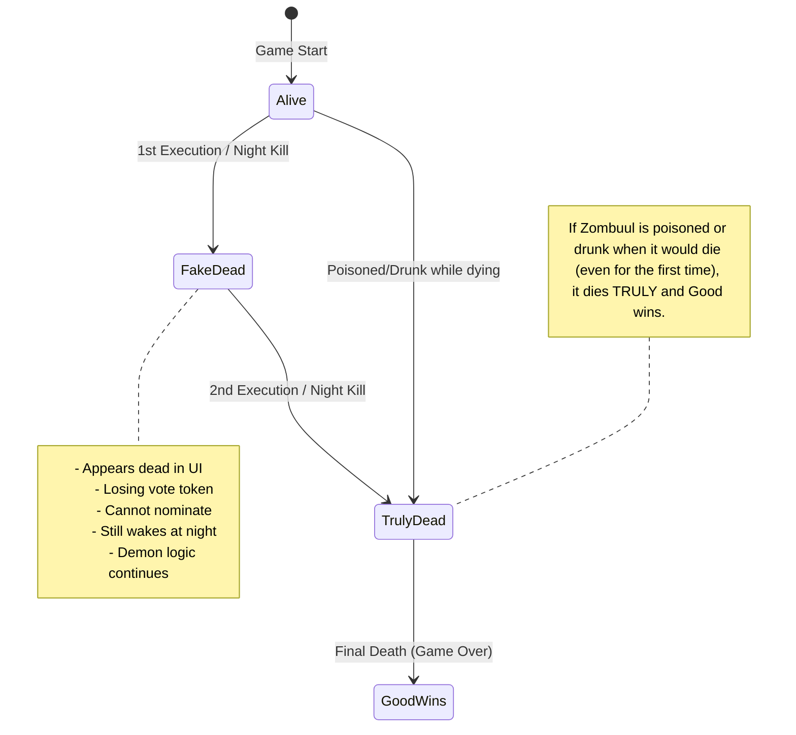

# Zombuul Life Cycle & State Machine

The Zombuul (僵怖) has a unique "fake death" mechanic where it appears to be dead to the town but remains functionally alive as the Demon.

## State Transitions

## Implementation Details

- **`isDead`**: Set to `true` when "Fake Dead", but the engine knows it's the Zombuul.
- **`isZombuulTrulyDead`**: A custom flag in the `Seat` state to track the actual elimination.
- **`zombuulLives`**: Remaining lives (default 1).
- **`checkGameOver`**: Specifically ignores "Fake Dead" Zombuul when counting alive evil players, yet keeps the game running if the Demon is the Zombuul.

### Night Awakening Logic
- The Zombuul only wakes if **no one died today** (including itself or via execution).
- A "Fake Death" counts as a death for that day's awakening check.
