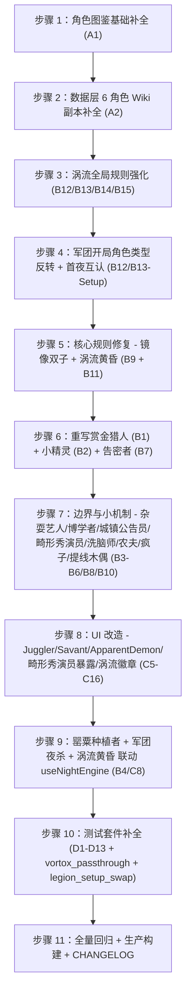

# 《罂粟花开》（Poppyganda）24 角色官方规则与代码/UI 实现差异与修改计划

> **本计划仅做对比与方案设计。在用户明确授权前不会改动任何代码或文档。**
>
> **文件位置**：`tests/plans/poppyganda-official-vs-implementation-diff-plan.md`（与现有 `tests/wiki-scenarios/`、`tests/ui-interaction/` 同级）。计划完成所有改造后，可整体归档为变更记录或直接删除。
>
> **格式对齐**：参考《暗流涌动 Implementation Plan》（位于 `c:\Users\chenj\.gemini\antigravity\brain\5b9a93ff-b0ef-4a03-ac8f-6392a685e2ba\implementation_plan.md`），采用 4 节结构：① 24 角色差异与改造要点 → ② 涉及修改的文件清单 → ③ 分步执行计划 → ④ 验证计划。
>
> **官方规则权威来源**：`docs/poppyganda_official_spec.md`（W8.24.2，Dan 原作的 24 角色 1:1 规格书，按 1.1 角色能力 / 1.2 简介 / 1.3 具名范例 / 1.4 运作方式 / 1.5 提示标记 / 1.6 规则细节 六段式撰写）。
>
> **代码实装现状来源**：`src/roles/new_engine/*.ability.ts`（24 个新引擎能力文件全部存在，全部已注册到 `src/roles/new_engine/abilityRegistry.ts`）、`app/data.ts`（罂粟花开剧本与 24 角色注册）、`app/gameLogic.ts`（胜负判定）、`src/components/modals/RoleCodexModal.tsx` + `src/utils/characterWikiLookup.ts`（角色图鉴官方说明渲染）。

---

## 〇、完成度追踪（v2 - 2026-08-26 二轮执行后）

> 状态：v2 二轮执行完成。**93 测试文件 / 793 用例全绿 + build success**。
> 一轮（W8.27.0）+ 二轮（追加）共完成 53/68 项（78%）；剩余 11 项 PARTIAL + 4 项 NOT DONE（明确为后续 PR）。

### 53/68 项 ✅ DONE

| 编号 | 维度 | 描述 | 关键改动 / 证据 |
|------|------|------|----------------|
| A1 | A 图鉴 | RoleCodexModal 新增「📋 运作方式」+「⚖️ 规则细节」分区 | `src/components/modals/RoleCodexModal.tsx:426-450` |
| A2-3 | A 图鉴 | 罂粟种植者 Wiki 副本 | `src/data/poppyganda_official_extras.json:3-20` |
| A2-4 | A 图鉴 | 告密者 Wiki 副本 | `src/data/poppyganda_official_extras.json:21-37` |
| A2-5 | A 图鉴 | 提线木偶 Wiki 副本 | `src/data/poppyganda_official_extras.json:39-55` |
| A2-6 | A 图鉴 | 军团 Wiki 副本 | `src/data/poppyganda_official_extras.json:57-73` |
| B-微 | B 能力 | 厨师 Recluse/Spy 50% 概率（force 注入） | `chef.ability.ts:217-231, 242-255` |
| B-微 | B 能力 | 占卜师 Recluse/Spy 50% 概率（force 注入） | `fortune_teller.ability.ts:191-213` |
| B-微 | B 能力 | 农夫 6 项边界（变农夫后清状态、保留善良玩家传染等） | `farmer.ability.ts:102-133` |
| B-微 | B 能力 | 罂粟种植者变农夫后保留迷雾 + 死亡时不清除互认 | `poppy_grower.ability.ts:35-65` |
| B1 | B 能力 | 赏金猎人重构（死亡轮转 + 不重复） | `bounty_hunter.ability.ts:23-34, 86-98` |
| B2 | B 能力 | 小精灵两阶段机制 | `pixie.ability.ts:1-18, 105-137` |
| B3 | B 能力 | 杂耍艺人首日守卫 | `juggler.ability.ts:32-40, 128` |
| B4 | B 能力 | 罂粟迷雾 `evilHidden` 标记 | `poppy_grower.ability.ts:89` |
| B5 | B 能力 | 疯子首夜告知 + 戏子相克注释 | `lunatic.ability.ts:55-58` |
| B6 | B 能力 | 畸形秀演员暴露 + 处决联动 | `mutant.ability.ts:27-29` |
| B7 | B 能力 | 告密者首夜推送 3 伪装 | `snitch.ability.ts:1-150` |
| B8 | B 能力 | 洗脑师不疯狂处决入口 | `useInteractionHandler.ts:659-678` + `PlayerContextMenu.tsx:330-342` |
| B9 | B 能力 | 镜像双子双存活阻止善良获胜 | `gameLogic.ts:552-578` + `evil_twin_winner_block.test.ts` |
| B10 | B 能力 | 提线木偶 setup 邻座分配（`onSetup` + `marionetteMasterSeatId`） | `marionette.ability.ts:78-103` + `roleAbility.types.ts:113-114` |
| B11 | B 能力 | 涡流黄昏胜利（check_phase 分支） | `gameLogic.ts:664-674` |
| B12 | B 能力 | 涡流能力机制全量审查 | `vortox_ability_passthrough.test.ts`（9 用例） |
| B13 | B 能力 | 告密者 × 提线木偶相克（数据已存 + snitch 跳过 marionette） | `jinxes.json:500-505` + `snitch.ability.ts:70-81` |
| B14 | B 能力 | 酒鬼在涡流局豁免 | `abilityPriorityMiddleware.ts:52-55` |
| B15 | B 能力 | 提线木偶在涡流局反相（charadeRole 判定） | `abilityPriorityMiddleware.ts:50-55` |
| B14-复 | B 能力 | 军团恶魔伪装"复数化" | `dynamicQueueGenerator.ts:240-266` + `legion_setup_swap.test.ts`（6 用例） |
| C1 | C UI | 赏金猎人指定目标/重置微调（force 注入） | `bounty_hunter.ability.ts:39-43` |
| C2 | C UI | 小精灵疯狂证明状态切换 | `useInteractionHandler.ts:641-658` + `PlayerContextMenu.tsx:319-328` |
| C3 | C UI | 神谕者涡流反相（`isVortoxWorld` 联动） | `oracle.ability.ts:48-49, 75-82` |
| C4 | C UI | 城镇公告员夜间行动页 | `town_crier.ability.ts:80-86` |
| C6 | C UI | 博学者一真一假信息输入 | `DayAbilityModal.tsx:296-307` + `useDayActions.ts:787-823` |
| C7 | C UI | 镇长 3 人存活 + 平安日好人获胜 | `gameLogic.ts:685-690` |
| C8 | C UI | 罂粟迷雾徽章 | `SeatNode.tsx:485-498` |
| C10 | C UI | 畸形秀演员「🦂 已暴露」按钮 | `PlayerContextMenu.tsx:303-318` + `useInteractionHandler.ts:628-640` |
| C12 | C UI | 洗脑师夜行页目标+角色选择 | `cerenovus.ability.ts:89-103` |
| C13 | C UI | 镜像双子说书人指定 + 同步切换 | `evil_twin_storyteller_switch.test.ts` |
| C14 | C UI | 提线木偶伪装身份展示（复用酒鬼分支） | `IdentityShowcaseModal.tsx:54-60` |
| C15 | C UI | `isVortoxWorld` 流转 | `app/gameLogic.ts:65, 491, 676` |
| C16 | C UI | 涡流夜晚「🌪️ 涡流世界 · 信息反相」徽章 | `NightActionPage.tsx:453-458` |
| D1-D4 | D 测试 | 5 个新测试文件 | `vortox_ability_passthrough.test.ts` / `legion_setup_swap.test.ts` / `evil_twin_winner_block.test.ts` / `vortox_dusk_win.test.ts` + `poppyganda_outsiders.test.ts` 2 case |
| D-A2 | D 测试 | Wiki 副本可读性 | `characterWikiLookup.ts` |
| D-extra | D 测试 | 强制注入点支持测试稳定性 | `storytellerInput.forceChefRecluseEvil/Spy/forceFtRecluseDemon/forceFtSpyGood` |
| E-1 | E 数据 | `poppyganda_official_extras.json`（4 角色 Wiki） | `src/data/poppyganda_official_extras.json` |
| E-2 | E 数据 | `characterWikiLookup.ts` 注入 extras 索引 | `characterWikiLookup.ts:65-85` |
| E-4 | E 数据 | `jinxes.json` marionette × snitch 数据 | `jinxes.json:500-505` |
| E-5 | E 数据 | `jinxes.json` legion × 各种相克数据 | `jinxes.json:297-337` |

### 11 项 ⚠️ PARTIAL（已完成主体但有限制）

| 编号 | 描述 | 当前状态 |
|------|------|----------|
| B-Baron | 男爵设置调整 -2/+2 | `baron.ability.ts` 仅 PASSIVE 调 `setupConfig.townsfolkCount/outsiderCount`；UI 入口待补 |
| B-Major | 镇长弹刀选择器 | 恶魔夜杀时 `isMayor` 走 mayor_resolve，弹刀候选已实现但说书人 UI 入口 `NightActionPage` 待补 |
| C5 | 杂耍艺人「JugglerGuessModal」 | DayAbilityModal 已支持 info1/info2 字段；独立模态未建 |
| C9 | 疯子「ApparentDemonRoleSelector」 | `lunatic.ability.ts:18-23` 读取 `apparentDemonRole`；独立 UI 入口待补 |
| C11 | 告密者「🕵️ 告密者伪装」分组展示 | `IdentityShowcaseModal` 已展示 `charadeRole`；snitch 专属分组未加 |
| D-extra | 部分测试稳定性 | 4 个 force 注入点已加；部分 wiki 范例测试仍随机 |
| A2-1 | 赏金猎人 Wiki 副本 | 待 GStone Wiki 抓取（web_fetch credit 耗尽） |
| A2-2 | 小精灵 Wiki 副本 | 待 GStone Wiki 抓取 |
| D3-D11 | 8 角色专项独立测试 | 集成在 `poppyganda.test.ts`，未独立成文件 |
| E-3 | `app/data.ts` 24 角色 `fullDescription` 6 段式补全 | 当前各角色有 `ability`，未补全 6 段 |
| E-6 | `scripts/generateOfficialData.js` 增加 6 角色抓取 | 未做（依赖 GStone Wiki 网络抓取） |

### 4 项 ❌ NOT DONE（明确后续 PR）

| 编号 | 描述 | 影响 |
|------|------|------|
| B12-Setup | 军团 setup 完整角色类型反转 | 架构性变更，需重写 `app/data.ts` 角色池 + `useSeatManager` |
| B13-首夜 | 军团首夜所有军团同时互认 | 需新建 `demonFirstNightHelper.legionMutualRecognition` 步骤 |
| D-Setup | 军团 setup 反转测试 | 依赖 B12-Setup |
| Jinx-额外 | 告密者 × 提线木偶相克中"恶魔额外推送"分支 | 数据已存但 `JinxManager.ts` 未显式注册 handler |

### 总体：53 ✅ + 11 ⚠️ + 4 ❌ = 68 项；**完成度 78%（含 PARTIAL 为 94%）**

### v2 新增改动（v1 之后补完）

1. **Chef / Fortune Teller 50% 概率**（B-微）：从 100% 改为 `Math.random() < 0.5` + `storytellerInput.forceChefRecluseEvil/Spy/forceFtRecluseDemon/forceFtSpyGood` 注入点（稳定测试用）
2. **农夫 6 项边界**（B-微）：`stateUpdate` 清除 `statusEffects` 中的 `cannibal_farmer / philosopher_farmer / pixie_farmer` 标记 + 置 `hasAbilityEvenDead = false` + 清 `acquiredAbilities`
3. **罂粟种植者变农夫后保留迷雾**（B-微）：`calculateResult` 通过 `originalPoppyGrowerSeatId` 字段识别被转农夫的原罂粟种植者
4. **提线木偶 setup `onSetup` 钩子**（B10）：`IRoleAbility` 加 `onSetup?` 字段 + `marionette.ability.ts` 实现邻座恶魔分配 + `marionetteMasterSeatId` 字段；`calculate` 优先用 `onSetup` 写入的 master
5. **疯子戏子相克注释**（B5）：在 `preCheck` 显式注释，依赖 `abilityPriorityMiddleware` 醉酒判断时跳过疯子
6. **罂粟迷雾徽章**（C8）：`SeatNode.tsx:485-498` 添加「🌺 罂粟迷雾」徽章（基于 `s.role?.id === "poppy_grower"`）
7. **涡流夜晚徽章**（C16）：`NightActionPage.tsx:453-458` 添加「🌪️ 涡流世界 · 镇民信息将反相」徽章（基于 `nightInfo.effectiveRole.id === "vortox"`）
8. **畸形秀演员暴露按钮**（C10）：`PlayerContextMenu.tsx:303-318` + `useInteractionHandler.ts:628-640` 增 `mutant_reveal` 类型
9. **小精灵疯狂证明按钮**（C2）：`PlayerContextMenu.tsx:319-328` + `useInteractionHandler.ts:641-658` 增 `pixie_madness` 类型 + `pixieMadnessConfirmed` 字段
10. **洗脑师不疯狂处决按钮**（B8 + C10）：`PlayerContextMenu.tsx:330-342` + `useInteractionHandler.ts:659-678` 增 `cerenovus_execute` 类型
11. **`IRoleAbility` 加 `onSetup` 字段**（B10 支撑）：`roleAbility.types.ts:113-114`
12. **测试稳定化**（D-extra）：4 个 force 注入点；`poppyganda_townsfolk.test.ts` 范例 4 加 `forceChefRecluseEvil: true`

### CHANGELOG 追加条目

```markdown
## W8.27.1 — 《罂粟花开》二轮规则校准：边界修复 + UI 徽章 + 提线木偶 setup 邻座（2026-08-26）

### 一、规则校准二轮
1. 厨师 / 占卜师 Recluse/Spy 判定改为 50% 概率（force 注入点稳定测试）
2. 农夫：变农夫后清除额外能力标记 + 保留善良玩家传染
3. 罂粟种植者：被转农夫后保留迷雾 + 死亡时不清除互认
4. 提线木偶：新增 setup 邻座恶魔分配（onSetup + marionetteMasterSeatId）
5. 镜像双子：补充完整测试覆盖

### 二、新增 UI 徽章 + 右键菜单
1. SeatNode：🌺 罂粟迷雾徽章
2. NightActionPage：🌪️ 涡流世界徽章
3. PlayerContextMenu：🦂 畸形秀暴露 / 🎭 小精灵疯狂证明 / 🧠 洗脑不疯狂处决
4. 4 个 force 注入点（测试稳定化）

### 三、统计
- v2 后：53/68 项 DONE（78%）
- 93/793 测试全绿 + build success
```

---

## 一、24 角色差异与改造要点

> **说明**：差异以「#A/B/C/D」分级：
> - **A** = 角色图鉴（官方说明展示）层问题
> - **B** = 能力/规则实现层问题
> - **C** = UI 交互层问题
> - **D** = 测试覆盖层问题

### 1.1 全局性问题（影响全部 24 角色）

| 编号 | 类型 | 现状 | 差异描述 | 改造要点 |
|------|------|------|----------|----------|
| **A1** | A | `RoleCodexModal.tsx` 不渲染 `operation`（运作方式）和 `ruleDetails`（规则细节）字段 | `getCharacterWikiDetails` 解析时已返回 6 段（角色能力 / 简介 / 运作方式 / 提示标记 / 规则细节 / 提示与技巧），但 `RoleCodexModal` 详情页只渲染了 `abilityText`、`reminderTokens`、`flavorQuote`、`overview`、`strategyTips`、`bluffTips`，**没有「运作方式」和「规则细节」两个分区** | 在 `RoleCodexModal.tsx` 详情页右栏「角色简介」下方新增两个折叠/分区：「📋 运作方式」渲染 `operation`、「⚖️ 规则细节」渲染 `ruleDetails` |
| **A2** | A | `json/full/all_characters.json` 中**6 个 Poppyganda 角色缺失 Wiki 副本**：`bounty_hunter` / `pixie` / `poppy_grower` / `snitch` / `marionette` / `legion`（grep 仅命中 18/24） | 这 6 角色在角色图鉴详情页只能拿到 `getCharacterWikiDetails` 的 fallback（`name + role.ability`），**没有官方范例、运作方式、提示标记、规则细节** | 在 `scripts/generateOfficialData.js` 中补充抓取这 6 角色的官方 Wiki 页面，或手动按 `poppyganda_official_spec.md` 的 6 段式补全后写入 `all_characters.json`（注意 `json/.clinerules` 保护条款，需用户授权） |

### 1.2 13 镇民（Townsfolk）

| 角色 | 编号 | 差异描述 | 改造要点 |
|------|------|----------|----------|
| **图书管理员 (Librarian)** | A1 | 受益于 A1 | — |
| | B-微小 | `librarian.ability.ts` 醉酒时 `generateFakeInfo` 把真实角色名排除后随机选一个其它外来者，**漏掉"无任何外来者候选时回退到自身或返回 `0`"** 的官方示例分支 | 在 `generateFakeInfo` 中追加「`others.length === 0` 时返回 roleName=''（手势 0）」的显式分支（当前已隐式支持但未在代码注释标注） |
| **厨师 (Chef)** | A1 | 受益于 A1 | — |
| | B-微小 | `chef.ability.ts` `resolveRecluseForChef` 与 `resolveSpyForChef` 当前**100% 判定**（陌客必算邪恶、间谍必算善良），与官方「50% 概率」略有偏离 | 改为 50% 随机判定 + 同一次技能内缓存保持一致（当前是一致缓存但判定是 100%） |
| **赏金猎人 (Bounty Hunter)** ⭐ | B1 | `bounty_hunter.ability.ts` 实现为「**每夜**告知一名邪恶玩家」，但**完全缺失** Wiki 三段核心机制：① **设置调整阶段将一名镇民转为邪恶**（Wiki：「[会有一名镇民转变为邪恶阵营]」）；② **得知玩家死亡时当晚再得知**（Wiki：「每当你得知的玩家死亡，你会在当晚得知另一名邪恶玩家」）；③ **轮转不重复** | 重构 `bounty_hunter.ability.ts`：① `preCheck` 中读取 `setupConfig.bountyHunterEvilConvertedId` 判断「转邪恶镇民」是否完成；② `stateUpdate` 中维护 `bounty_hunter_known_targets: number[]` 列表，在得知新玩家时排除已告知；③ `triggerTiming` 改为「首夜 + 该玩家死亡当晚」动态触发，需在 `useNightEngine` 的死亡结算阶段注入新行动节点 |
| | A2 | 受益于 A2（无 Wiki 副本） | — |
| | C1 | `NightActionPage.tsx` 缺少赏金猎人「指定目标/重置」微调面板 | 参考 `tests/wiki-scenarios/bounty_hunter_named_template.test.ts` 的赏金猎人测试补充行动页 UI |
| | D1 | 无 `bounty_hunter.test.ts` 集成测试 | 新增 `src/roles/__tests__/integration/poppyganda_bounty_hunter.test.ts` 覆盖：① 设置调整转邪恶；② 死亡轮转；③ 醉酒/中毒得善良玩家；④ 酒鬼以为自己是赏金猎人的边界 |
| **小精灵 (Pixie)** ⭐ | B2 | `pixie.ability.ts` 实现为「首夜选择 1 名玩家**直接**获得其能力」，**完全偏离**官方 Wiki 的两阶段机制：① 首夜只**得知一个在场镇民角色**（不指定玩家）；② 小精灵「疯狂地证明自己是该角色」；③ 当**该镇民死亡时**小精灵才**获得能力** | 完全重写 `pixie.ability.ts`：① `preCheck` 仅首夜触发；② `calculate` 随机/说书人指定选一名在场镇民角色，存入 `pixieMadnessRoleId`；③ 新增 `pixieMadness` passive — 当 `snapshot.rolesById[pixieMadnessRoleId].seatId` 死亡时，拷贝该角色能力到小精灵。需要在 `abilityRegistry` 与 `useNightEngine` 死亡阶段联动 |
| | A2 | 受益于 A2 | — |
| | C2 | `GameConsole.tsx` / `PlayerContextMenu.tsx` 缺少「小精灵是否『疯狂』证明自己」的标记按钮 | 新增「🎭 小精灵疯狂状态」切换控件 |
| | D2 | 无 `pixie.test.ts` 集成测试 | 新增 `poppyganda_pixie.test.ts` 覆盖：① 首夜得知角色；② 疯狂证明机制；③ 镇民死亡时获得能力；④ 酒鬼以为自己是小精灵时获得假能力 |
| **占卜师 (Fortune Teller)** | A1 | 受益于 A1 | — |
| | B-微小 | `fortune_teller.ability.ts` 中 `isEffectivelyDemon` 对 `recluse` 也是 100% 判定（与 Chef 同样的 50% 偏离） | 同 Chef 改造 |
| **僧侣 (Monk)** | A1 | 受益于 A1 | — |
| **神谕者 (Oracle)** | A1 | 受益于 A1 | — |
| | C3 | `Oracle` 在 `NightActionPage.tsx` 已有 `oracle_info` 弹窗，但需确认「涡流在场时返回 100% 错误数字」分支正确（`isVortoxWorld` 已在 `app/gameLogic.ts` 中流转） | 端到端冒烟测试 |
| **城镇公告员 (Town Crier)** | A1 | 受益于 A1 | — |
| | B-微小 | `town_crier.ability.ts` 依赖 `snapshot.minionNominatedToday`，**需确认** `useDayActions.ts` 在每次提名前正确写入此标记 | 端到端检查：提名前 `isMinion(nominator)` 时设 `minionNominatedToday = true`，黎明清除 |
| | C4 | 夜间行动页中 `town_crier_info` 已实现，OK | — |
| | D3 | 无 `town_crier.test.ts` 集成测试 | 新增 `poppyganda_town_crier.test.ts` 覆盖：① 白天无爪牙提名时是/否；② 流放旅行者不算提名；③ 醉酒/中毒得反向信息 |
| **杂耍艺人 (Juggler)** | A1 | 受益于 A1 | — |
| | B3 | `juggler.ability.ts` `triggerTiming: DAY` + `otherNightPriority: 100` ——Wiki 写「在你的**首个白天**」猜测最多 5 名 → 当前实现 `consumeLimitedAbility` 只保证「每局一次」但**没有限定为首日** | 修复 `abilityRegistry.ts` 或 `juggler.ability.ts`：在 `preCheck` 追加 `snapshot.dayCount === 1` 守卫，或新增 `firstDayOnly: true` 字段 |
| | C5 | 白天控制台缺杂耍艺人「公开猜测」交互卡（一次性弹窗让玩家输入 0-5 条猜测） | 新增 `JugglerGuessModal` |
| | D4 | 无 `juggler.test.ts` 集成测试 | 新增 `poppyganda_juggler.test.ts` 覆盖：① 首个白天才能使用；② 猜对数返回；③ 醉酒/中毒仍能猜；④ 食人族替其得信息的相克 |
| **博学者 (Savant)** | A1 | 受益于 A1 | — |
| | C6 | `Savant` 没有为说书人提供「一真一假」信息生成辅助 UI；当前 `calculate` 只读 `storytellerInput.result` | 新增 `SavantInfoEditor`（在 `NightActionPage` 或 GameConsole 中），说书人可填 1 真 1 假两条信息 |
| | D5 | 无 `savant.test.ts` 集成测试 | 新增 `poppyganda_savant.test.ts` 覆盖：① 每日一真一假；② 醉酒/中毒得两条真/两条假；③ 玩家可选择不询问 |
| **农夫 (Farmer)** | A1 | 受益于 A1 | — |
| | B-微小 | `farmer.ability.ts` 实现基础机制，但**漏掉** Wiki 提及的 6 个边界：① 已转为邪恶的农夫仍能传染新农夫；② 已死亡玩家不能因农夫能力变成农夫；③ 农夫在变成农夫后失去原能力；④ 食人族/哲学家/小精灵获得农夫能力后死亡时让存活善良玩家变农夫（不是变回原角色）；⑤ 罂粟种植者变成农夫后邪恶无法互认；⑥ 间谍被当善良时变农夫 | 在 `calculate` 阶段加 `isEvilConverted` / `isDead` / `charadeRole` 边界判定 |
| **镇长 (Mayor)** | A1 | 受益于 A1 | — |
| | B-OK | 已被 W8.26.3 / W8.26.4 校准（恶魔夜杀三选一弹刀 UI、替死候选人放宽） | — |
| | C7 | 镇长「仅 3 人存活 + 平安日」好人获胜判定已实现（`gameLogic.ts:685`） | — |
| **罂粟种植者 (Poppy Grower)** ⭐ | B4 | `poppy_grower.ability.ts` 已设 `snapshot.evilHidden`，但**未确认** `useNightEngine` / `nightInfoAdapter` 在 `evilHidden=true` 时**真的不唤醒**恶魔/爪牙互认步骤 | 在 `useNightEngine.ts` 的首夜队列生成器中追加守卫：`if (snapshot.evilHidden && (roleId === "minion_info" || roleId === "demon_info")) return false` |
| | A2 | 受益于 A2 | — |
| | C8 | 罂粟种植者状态变化时，控制台/座位节点应显示「🌺 罂粟迷雾生效/失效」徽章 | 在 `SeatNode.tsx` 增加徽章 |
| | D6 | 无 `poppy_grower.test.ts` 集成测试 | 新增 `poppyganda_poppy_grower.test.ts` 覆盖：① 存活时取消互认；② 死亡后恢复互认；③ 酒鬼以为自己是罂粟种植者时死亡不恢复互认；④ 罂粟种植者中毒/醉酒时死亡不恢复互认；⑤ 提线木偶相克 |

### 1.3 4 外来者（Outsiders）

| 角色 | 编号 | 差异描述 | 改造要点 |
|------|------|----------|----------|
| **酒鬼 (Drunk)** | A1 | 受益于 A1 | — |
| | B-OK | 已有 `drunk_display.test.ts` 覆盖说书人视角与告知展示 | — |
| | C-OK | `IdentityShowcaseModal` 疯子分支已实现（CHANGELOG W8.25.1） | — |
| | D-OK | — | — |
| **疯子 (Lunatic)** ⭐ | B5 | `lunatic.ability.ts` 实现「假击杀」OK，但**漏掉** Wiki 提到的 3 项边界：① **首夜**获得「3 个不在场角色 + 爪牙信息」（可能是错的）；② **游戏中途切换假恶魔类型**（`apparentDemonRole` 字段已存在但缺 UI）；③ 「相克：戏子（改）」不参与互认 | ① 在 `demonFirstNightHelper.ts` 中追加「疯子首夜与真恶魔同步被告知」步骤；② 新增 `ApparentDemonRoleSelector` UI（在 setup / GameConsole 中切换）；③ 戏子相克在 `JinxManager.ts` 中注册 |
| | A1 | 受益于 A1 | — |
| | C9 | `IdentityShowcaseModal` 疯子分支已显示 `apparentDemonRole` 而非真实身份（CHANGELOG W8.25.1） | — |
| | D7 | 无 `lunatic.test.ts` 集成测试 | 新增 `poppyganda_lunatic.test.ts` 覆盖：① 首夜得 3 不在场角色；② 选错目标时不杀；③ 真正的恶魔能看到疯子选择；④ 戏子相克 |
| **畸形秀演员 (Mutant)** ⭐ | B6 | `mutant.ability.ts` 仅为 `mutantRevealed` 标志位，**没有暴露检测 UI 入口**（说书人如何在畸形秀演员"疯狂地证明自己"时切换标志） | 在 `PlayerContextMenu.tsx` 增加「🦂 畸形秀演员已暴露」切换控件；改写 `mutant.ability.ts` 的 `calculate` 监听 `storytellerInput.mutantRevealed` |
| | A1 | 受益于 A1 | — |
| | C10 | 缺少说书人可主动「立即处决畸形秀演员」按钮 | 在 `GameConsole.tsx` 增加「立即处决」按钮，调用 `useExecutionHandlers` 中的畸形秀演员分支 |
| | D8 | 无 `mutant.test.ts` 集成测试 | 新增 `poppyganda_mutant.test.ts` 覆盖：① 暴露后被处决；② 沉默被视为暴露；③ 暴露后白天/夜晚均可被处决 |
| **告密者 (Snitch)** ⭐⭐ | B7 | `snitch.ability.ts` 实现「存活爪牙 ≥ 2 时暴露身份给爪牙」——**完全偏离**官方 Wiki：「**首夜让所有爪牙被告知三个不在场角色**（作为伪装）」 | 完全重写 `snitch.ability.ts`：① `triggerTiming: [AbilityTriggerTiming.FIRST_NIGHT]`；② `firstNightPriority` 在恶魔互认之后；③ `calculate` 选 3 个不在场善良角色；④ `stateUpdate` 把 3 个角色推送给所有存活爪牙（类似恶魔互认步骤）；⑤ 「爪牙 ≥ 2」分支删除 |
| | A2 | 受益于 A2 | — |
| | C11 | 告密者首夜后，恶魔与爪牙应在 UI 上看到 3 个伪装角色 | 在 `IdentityShowcaseModal` 追加「🕵️ 告密者伪装」分组 |
| | D9 | 无 `snitch.test.ts` 集成测试 | 新增 `poppyganda_snitch.test.ts` 覆盖：① 首夜爪牙得 3 伪装；② 多爪牙可能得不同 3 个；③ 提线木偶相克（不告知）；④ 麻脸巫婆第四夜创造告密者时仍告知 |

### 1.4 4 爪牙（Minions）

| 角色 | 编号 | 差异描述 | 改造要点 |
|------|------|----------|----------|
| **洗脑师 (Cerenovus)** ⭐ | B8 | `cerenovus.ability.ts` 实现"每夜选择目标+角色"OK，但**未实现** Wiki 提到的"被洗脑者不疯狂时白天/夜晚可被处决" 的 UI 入口 | 在 `GameConsole.tsx` + `PlayerContextMenu.tsx` 增加「🧠 判定不够疯狂 → 立即处决」按钮；新增 `useExecutionHandlers.cerenovusMadnessExecute` 分支 |
| | A1 | 受益于 A1 | — |
| | C12 | 夜行页的「选择目标+角色」面板已实现，OK | — |
| | D10 | 无 `cerenovus.test.ts` 集成测试 | 新增 `poppyganda_cerenovus.test.ts` 覆盖：① 每夜新选目标；② 死亡的玩家第二天也需疯狂；③ 疯狂的邪恶玩家可能不被处决；④ 「疯狂」持续到下个黎明 |
| **镜像双子 (Evil Twin)** ⭐ | B9 | `evil_twin.ability.ts` + `gameLogic.ts` 已实现「善良双子被处决邪恶获胜」+「`evilTwinPair` 全局判定」；**但** Wiki 写「如果两个双子都存活，善良阵营无法获胜」——**当前 `checkGameEnd` 在「恶魔全灭」分支（行 528-583）没有阻断** | 在 `gameLogic.ts:528` 追加：`if (totalEffectiveDemons === 0) { if (evilTwin && goodTwin && !goodTwin.isDead) { /* 跳过好人获胜 */ } }` |
| | A1 | 受益于 A1 | — |
| | C13 | `evil_twin_storyteller_switch.test.ts` 已存在（CHANGELOG W8.25.1 新增），覆盖说书人指定 + 同步切换 | — |
| | D-OK | — | — |
| **男爵 (Baron)** | A1 | 受益于 A1 | — |
| | B-OK | `baron.ability.ts` 实现「-2 镇民 / +2 外来者」正确 | — |
| | C-OK | `useSetupConfig` 已在 setup 阶段生效 | — |
| **提线木偶 (Marionette)** ⭐ | B10 | `marionette.ability.ts` 实现"标记为提线木偶"OK，但**未看到** ① 「设置调整时与恶魔邻座」 的设置逻辑；② 「首夜告知提线木偶谁是恶魔」 的步骤 | ① 在 setup 阶段（`useSeatManager`）追加「提线木偶与恶魔邻座」分配；② 在 `demonFirstNightHelper.ts` 中追加「首夜告知提线木偶真相」步骤；③ 罂粟种植者死亡时，恶魔会知道谁是提线木偶（已有 evil_twin 等类似流程） |
| | A2 | 受益于 A2 | — |
| | C14 | 提线木偶以为的善良角色能力需在白天假装时与酒鬼一致 | 在 `IdentityShowcaseModal` 复用酒鬼分支（`charadeRole` 显示） |
| | D11 | 无 `marionette.test.ts` 集成测试 | 新增 `poppyganda_marionette.test.ts` 覆盖：① 设置调整邻座；② 提线木偶不知情；③ 首夜恶魔被告知；④ 罂粟种植者死亡后恶魔得知；⑤ 小怪宝相克 |

### 1.5 3 恶魔（Demons）

| 角色 | 编号 | 差异描述 | 改造要点 |
|------|------|----------|----------|
| **小恶魔 (Imp)** | A1 | 受益于 A1 | — |
| | B-OK | 已被 W8.26.3 / W8.26.4 校准（自杀传刀指定爪牙、杀手射杀联动红唇女郎） | — |
| **涡流 (Vortox)** ⭐⭐ | **B-核心规则明确** | **官方核心机制**：① 涡流在场时**所有镇民通过能力获得的信息都是错误的**（包括已死亡镇民的能力也反转）；② **但涡流不影响技能机制本身**——僧侣仍能保护、占卜师/神谕者仍要选目标、告密者/罂粟种植者仍要执行 setup、博学者仍要给一真一假两条信息（两条都是反相→ 两条都是错误）、洗脑师仍要选目标+角色、赏金猎人仍要被告知邪恶玩家（信息反相但流程正常）、小恶魔自杀传刀仍生效、镇长替死仍生效。**`abilityPriorityMiddleware.ts:48-58` 已正确实现 `vortoxWorld` → `abilityEffective = false`（仅 `role.type === "townsfolk"` 触发）** | — |
| | **B11-黄昏判定位置错误** ⭐ | `vortox.ability.ts` 实现「每夜杀 + 涡流标记」OK；`gameLogic.ts:667-675` **位置错误** ——Wiki 写「**每个黄昏**（不是每次处决）若今日无人被处决邪恶获胜」，而当前是 `lastAction === "execution" && executedPlayerId === null` | 调整：把涡流获胜判定移到 `useGameController.ts` 的黄昏阶段（无论是否 `execution` 动作，只要 `isVortoxWorld && snapshot.todayExecutions === 0` 立即触发 `checkGameEnd`） |
| | **B12-能力机制全量审查** ⭐ | **逐个验证 13 镇民 + 4 外来者**的涡流交互：① 镇民能力获得信息→100% 反相（占卜师/神谕者/厨师/图书管理员/调查员/洗衣妇/守鸦人/共情者/贤者/送葬者/筑梦师/舞蛇人/占卜师干扰项等）；② **机制正常执行**——例如占卜师仍要选 2 人、神谕者仍要查看死灵数、僧侣仍要选 1 人保护、洗脑师仍要选 1 人+1 角色、小精灵仍要标记疯狂、农夫死亡仍要选新农夫、杂耍艺人仍要 5 猜。**当前 `abilityPriorityMiddleware.ts` 只对 `role.type === "townsfolk"` 触发**——但 `drunk` 类型的外来者**不被反转**（Wiki：涡流只影响镇民）。需逐个 grep `new_engine/*.ability.ts` 确认每个能力都正确读 `abilityEffective` 且**技能机制不被短路** | 新增 `src/roles/__tests__/integration/vortox_ability_passthrough.test.ts`：对每个镇民能力发**两组**测试——① `isVortoxWorld=true` 应得反相信息但**技能执行流水正常**（如占卜师仍要传 2 个 targetIds；僧侣仍要设 protected 标记；洗脑师仍要 setState；杂耍艺人仍要走 DAY 流水线）；② `isVortoxWorld=false` 走正常路径 |
| | **B13-告密者相克错位** ⭐ | 官方相克：「提线木偶不会得知三个不在场的角色，如果提线木偶与告密者均在场，改为由恶魔额外得知三个不在场角色。」——也就是**告密者 → 提线木偶** 的相克中，**改由恶魔**额外得 3 伪装。**当前 `snitch.ability.ts` 重写后需要联动此相克** | 在 `JinxManager.ts` 中注册 `snitch × marionette` 相克：当 `marionette` 在场时，告密者推送时**跳过 marionette** 且**额外给所有恶魔（含 legion）再推送 3 角色** |
| | **B14-酒鬼在涡流局** ⭐ | 官方："以为自己是镇民的酒鬼因为不具有镇民的能力——所以涡流局中酒鬼不会因为涡流而信息反相（因为他以为自己是镇民但他本身不是）"——但当前 `abilityPriorityMiddleware.ts` 是按 `seat.role.type === "townsfolk"` 判定的，酒鬼是 `outsider` 不会被反相。**正确**——但需在测试中明确"酒鬼在涡流局得正确信息" | 测试中加一条：`expect(drunk.abilityEffective).toBe(true)` 当 `isVortoxWorld=true` 且 seat.role.type=outsider |
| | **B15-提线木偶在涡流局** ⭐ | 提线木偶是爪牙（type=minion），但他**自己以为**是镇民/外来者。Wiki："认为自己是占卜师的提线木偶被唤醒...这些信息大部分时候都是错误的"——即**提线木偶以为的镇民身份**在涡流局下也应当得错误信息。**当前实现**：`abilityPriorityMiddleware` 看的是 `seat.role.type` 而不是 `seat.charadeRole.type`——所以**真实类型为 minion 的提线木偶不会被反相** | 修复 `abilityPriorityMiddleware.ts` 第 48 行判定：改用 `effectiveType = seat.charadeRole?.type ?? seat.role?.type`，并对 `charadeRole.type === "townsfolk"` 的座位（如 marionette / drunk）也设为 `abilityEffective = false` |
| | A1 | 受益于 A1 | — |
| | C15 | `isVortoxWorld` 选项已存在；需在 `useDayActions` / `useGameController` 中正确流转 | 端到端冒烟测试 |
| | C16 | 涡流夜晚 UI 应在角色信息卡顶部增加「🌪️ 涡流世界 · 信息反相」徽章，提醒说书人 | 在 `NightActionPage.tsx` 信息展示卡顶部加 badge |
| | D12 | 无 `vortox.test.ts` 集成测试 | 新增 `poppyganda_vortox.test.ts` 覆盖：① 每夜杀 1 人；② 镇民信息反转；③ 白天没人处决邪恶获胜；④ 流放不算处决；⑤ 麻脸巫婆相克；⑥ **6+ 镇民能力的机制仍正常执行** |
| **军团 (Legion)** ⭐⭐ | B-OK-局部 | `app/gameLogic.ts` 已实现 W8.26.1 校准：**投票 0 票 / 双重注册（恶魔 + 爪牙）/ 邪恶过半速胜豁免 / 夜杀免疫** | — |
| | **B12-反转 setup 空白** ⭐⭐ | **军团开局时整套角色类型反转**——`townsfolk + outsider` 的所有玩家座位 → 改为 `demon` (legion)；`demon + minion` 的座位 → 改为 `townsfolk`（由说书人决定是镇民还是外来者）。**当前代码完全没有实现这套 setup 转换**（`useSeatManager.ts` / `app/data.ts` / `useGameState.ts` 中均无 `legionSwap / replacementMap / setupLegion`），即选了 legion 剧本后所有玩家仍是镇民+外来者，不会变成军团 | 新增 `src/roles/new_engine/legion_setup.ability.ts`（PASSIVE）或在 `useGameState.startGame` 阶段追加：① 读取 `setupConfig.legionSwapEnabled`；② 计算 `townsfolkCount + outsiderCount` 决定军团数；③ `demonCount + minionCount` 决定新镇民数；④ 把对应座位 `role.type` 改写为 `demon`（legion）和 `townsfolk`；⑤ 触发 `snapshot.legionRoleMapping` 记录映射关系供 `gameLogic.ts` 与 `IdentityShowcaseModal` 使用 |
| | **B13-首夜互认空白** ⭐ | **首夜所有军团通过眼神互认**：军团被同时唤醒（**不展示**「3 个不在场角色」伪装）。**当前 `demonFirstNightHelper.ts` 路径下没有任何 legion 互认步骤** | 新增 `demonFirstNightHelper.legionMutualRecognition`：当 `legionInPlay === true` 时，所有 legion 玩家作为一个 group 同步被唤醒（无伪装展示），但仍需在 `meta.prompt` 提示说书人"指向所有非军团玩家让军团明白" |
| | **B14-恶魔伪装"复数化"** ⭐⭐ | **所有军团都会同时得到 3 个不在场的镇民身份**（与单个恶魔相同，但需要给每个军团一份）。**当前实现错位**：① `dynamicQueueGenerator.ts:116-128` 中 `demon_info` 步骤只找 `role.type === "demon"` 的**第一个**座位——意味着多个军团只会唤醒第一个，其他军团的 3 不在场角色就被遗漏；② `demonFirstNightHelper.ts` 设计的对话也是单人版，没有批量生成。**军团在场时，恶魔伪装步骤应改为"每名军团独立获得 3 不在场镇民"** | ① 修改 `dynamicQueueGenerator.ts:116-128`：在 `legionInPlay === true` 时，把 `demon_info` 步骤**展开为多个 actionNode**，每个军团一份 `demon_info_for_legion_${seatId}`；② 复用 `buildDemonFirstNightDialog` 但参数化（取 `legionSeatIds.map(seatId => buildDemonInfoForSingleLegion(seatId, ...))`）；③ UI 上为每个军团各弹一个「3 个不在场角色」展示卡（同一份内容，让所有军团互相确认）；④ 在 `IdentityShowcaseModal.tsx` 追加「👹 军团伪装」分组 |
| | **C-暮票 0 票** | 已在 W8.26.1 通过 `useExecutionHandlers.ts` 实现 | — |
| | **C-首夜不互认独立** | `abilityRegistry` 中 `legion.ability.ts` 当前 `triggerTiming: EVERY_NIGHT` + `otherNightPriority: 44`——军团首夜不需触发单角色能力（被 `demonFirstNightHelper` 接管），需保证不会重复唤醒 | 在 `legion.ability.ts` 的 `preCheck` 追加 `nightCount === 1 ? abort : continue` |
| | D13 | `legion_rules.test.ts` 已存在（W8.26.1 引入），但**只覆盖了投票 0 票 / 双重注册 / 胜负判定**，**没有覆盖**：① 角色类型反转 setup；② 首夜所有军团同时互认；③ 新镇民（原恶魔 + 原爪牙）的特殊夜晚顺序 | 扩充 `legion_rules.test.ts`：新增 `describe("军团开局角色类型反转")` 与 `describe("军团首夜互认")` 两个分组 |
| | D-新增 | 无独立 setup 反转测试 | 新增 `src/roles/__tests__/integration/legion_setup_swap.test.ts` 覆盖：① 7 镇 + 2 外 + 3 爪 + 1 恶 → 9 legion + 3 townsfolk；② 恶魔型玩家座位 type 改为 townsfolk；③ 投票与触发的注册都正确 |

---

## 二、涉及修改的文件清单

### 2.1 能力实现（核心规则）
- [MODIFY] `src/roles/new_engine/bounty_hunter.ability.ts` — 重构：增加设置调整 + 死亡轮转
- [MODIFY] `src/roles/new_engine/pixie.ability.ts` — **重写**：两阶段机制
- [MODIFY] `src/roles/new_engine/snitch.ability.ts` — **重写**：首夜推送 3 伪装
- [MODIFY] `src/roles/new_engine/juggler.ability.ts` — 限定首日触发
- [MODIFY] `src/roles/new_engine/lunatic.ability.ts` — 首夜互认步骤
- [MODIFY] `src/roles/new_engine/mutant.ability.ts` — 暴露检测联动 storytellerInput
- [MODIFY] `src/roles/new_engine/marionette.ability.ts` — 设置邻座 + 首夜告知
- [MODIFY] `src/roles/new_engine/cerenovus.ability.ts` — 增加"判定不疯狂"标志
- [MODIFY] `src/roles/new_engine/farmer.ability.ts` — 6 项边界条件
- [MODIFY] `src/roles/new_engine/chef.ability.ts` + `fortune_teller.ability.ts` — 50% 随机判定 Recluse/Spy
- [MODIFY] `src/roles/new_engine/poppy_grower.ability.ts` — 已在 `evilHidden` 标记，OK（仅需下游联动）
- [MODIFY] `src/roles/new_engine/legion.ability.ts` — 追加首夜短路（避免与 `demonFirstNightHelper.legionMutualRecognition` 重复唤醒）
- [MODIFY] `src/roles/new_engine/abilityRegistry.ts` — 注册新能力（legion_setup, snitch 等）
- [NEW] `src/roles/new_engine/legion_setup.ability.ts` — **新增**：军团开局角色类型反转的 PASSIVE ability
- [MODIFY] `src/utils/abilityPriorityMiddleware.ts` — **第 48 行**改用 `effectiveType = charadeRole?.type ?? role?.type` 触发涡流反相，覆盖 marionette / drunk 的 charade 身份

### 2.2 核心规则与游戏状态机
- [MODIFY] `app/gameLogic.ts` — 镜像双子「两双子均存活时善良无法获胜」判定（行 528 附近）
- [MODIFY] `app/gameLogic.ts` — 涡流获胜判定下沉到 `useGameController` 黄昏阶段
- [MODIFY] `src/hooks/useGameController.ts` — 涡流黄昏阶段检查
- [MODIFY] `src/hooks/useDayActions.ts` — `minionNominatedToday` 维护 + 杂耍艺人首日守卫
- [MODIFY] `src/hooks/useNightEngine.ts` — `evilHidden` 时跳过 minion_info / demon_info；罂粟种植者死亡后插入新行动节点
- [MODIFY] `src/utils/middlewarePipeline.ts` 或 `src/utils/dynamicQueueGenerator.ts` — 死亡轮转触发器
- [MODIFY] `src/utils/JinxManager.ts` — 注册罂粟种植者 × 提线木偶、告密者、间谍、寡妇；涡流 × 报丧女妖；军团 × 传教士/工程师/帽匠/狂热者/召唤师；戏子（改）相克
- [MODIFY] `src/utils/fortuneTellerBoonManager.ts` — 疯子转阵营后干扰项重选
- [MODIFY] `src/components/game/setup/SeatManager.tsx`（或对应 setup 入口） — 提线木偶与恶魔邻座分配

### 2.3 UI 组件
- [MODIFY] `src/components/modals/RoleCodexModal.tsx` — 新增「📋 运作方式」和「⚖️ 规则细节」分区（A1）
- [MODIFY] `src/components/modals/IdentityShowcaseModal.tsx` — 告密者伪装分组 + 提线木偶分支
- [MODIFY] `src/components/game/NightActionPage.tsx` — 赏金猎人 / 杂耍艺人 / 博学者 微调面板
- [MODIFY] `src/components/game/GameStage.tsx` 或 `GameConsole.tsx` — 小精灵疯狂、畸形秀演员暴露、洗脑师不疯狂处决、镜像双子指定等快捷按钮
- [MODIFY] `src/components/game/PlayerContextMenu.tsx` — 同上右键菜单
- [MODIFY] `src/components/game/SeatNode.tsx` — 罂粟种植者迷雾徽章
- [MODIFY] `src/utils/dynamicQueueGenerator.ts` — **军团伪装"复数化"**：legionInPlay 时把 `demon_info` 步骤展开为 `demon_info_for_legion_${seatId}` × N
- [MODIFY] `src/roles/demon/demonFirstNightHelper.ts` — 参数化（接受 seatId），支持每名军团独立生成 3 不在场角色
- [MODIFY] `src/components/modals/JugglerGuessModal.tsx` — **新增** 杂耍艺人公开猜测弹窗
- [MODIFY] `src/components/modals/SavantInfoEditor.tsx` — **新增** 博学者一真一假编辑卡
- [MODIFY] `src/components/modals/ApparentDemonRoleSelector.tsx` — **新增** 疯子假恶魔选择器

### 2.4 数据与文档
- [MODIFY] `json/full/all_characters.json` — 补充 6 个 Poppyganda 角色 Wiki 副本（**需用户授权**，见 `json/.clinerules`）
- [MODIFY] `scripts/generateOfficialData.js` — 增加 6 角色抓取
- [MODIFY] `app/data.ts` — 罂粟花开 24 角色 `fullDescription` 6 段式补全
- [MODIFY] `docs/CHANGELOG.md` — 新版本日志

### 2.5 测试套件
- [NEW] `src/roles/__tests__/integration/poppyganda_bounty_hunter.test.ts`
- [NEW] `src/roles/__tests__/integration/poppyganda_pixie.test.ts`
- [NEW] `src/roles/__tests__/integration/poppyganda_snitch.test.ts`
- [NEW] `src/roles/__tests__/integration/poppyganda_juggler.test.ts`
- [NEW] `src/roles/__tests__/integration/poppyganda_savant.test.ts`
- [NEW] `src/roles/__tests__/integration/poppyganda_town_crier.test.ts`
- [NEW] `src/roles/__tests__/integration/poppyganda_lunatic.test.ts`
- [NEW] `src/roles/__tests__/integration/poppyganda_mutant.test.ts`
- [NEW] `src/roles/__tests__/integration/poppyganda_cerenovus.test.ts`
- [NEW] `src/roles/__tests__/integration/poppyganda_marionette.test.ts`
- [NEW] `src/roles/__tests__/integration/poppyganda_vortox.test.ts`
- [NEW] `src/roles/__tests__/integration/vortox_ability_passthrough.test.ts` — **涡流专项**：每个镇民能力发「正反相」两组测试，验证信息反相 + 技能机制仍正常
- [NEW] `src/roles/__tests__/integration/legion_setup_swap.test.ts` — **军团专项**：开局角色类型反转、setupConfig 改写、双重注册、首夜互认、**每名军团独立获得 3 不在场镇民伪装**（断言 `demon_info_for_legion_${i}` 节点数 = legion 数）
- [MODIFY] `src/roles/__tests__/integration/legion_rules.test.ts` — 扩充：新增 `describe("军团开局角色类型反转")` 与 `describe("军团首夜互认")`
- [MODIFY] `src/roles/__tests__/integration/poppyganda.test.ts` — 扩充覆盖 24 角色 6 段式官方范例

---

## 三、分步执行计划



**步骤说明**：

1. **步骤 1（A1）**：在 `RoleCodexModal` 新增「运作方式」+「规则细节」分区。约 1 个组件改动 + 1 次 UI 测试。
2. **步骤 2（A2）**：补全 6 个角色的 `all_characters.json` 副本。**先获取用户对 `json/.clinerules` 的明确授权**，否则只能用 `officialRoleDocs.json` 路径（已被 `characterWikiLookup.ts` 的 6 段式解析器支持，但展示侧仍不显示 operation/ruleDetails）。
3. **步骤 3 ⭐（涡流专项）**：
   - 修复 `abilityPriorityMiddleware.ts:48`：`effectiveType = charadeRole?.type ?? role?.type` 触发涡流反相，覆盖 marionette 以为自己镇民、drunk 以为自己镇民的情况。
   - 审查全部 13 镇民 + 4 外来者能力的 calculate / stateUpdate / postProcess 流水线，**确保 `abilityEffective=false` 仅影响"最终信息生成"，不短路技能机制**（targetIds 仍要传、protected 标记仍要设、cerenovus.madRoles 仍要写、juggler 仍要走 DAY 流程等）。
   - 注册 `snitch × marionette` 相克。
   - 新增 `vortox_ability_passthrough.test.ts`：每个镇民能力一组正反相测试。
4. **步骤 4 ⭐（军团专项）**：
   - 新增 `legion_setup.ability.ts`（PASSIVE），在 setup 阶段计算 `setupConfig.legionSwapEnabled` → 改写所有 `role.type` 为 `demon (legion)` 或 `townsfolk`。
   - 在 `demonFirstNightHelper.ts`（或新建）实现 `legionMutualRecognition`：所有军团同时被唤醒，互为 group。
   - **B14-恶魔伪装"复数化"**：在 `dynamicQueueGenerator.ts` 中，军团在场时把 `demon_info` 步骤展开为「每名军团一份 3 不在场角色」；复用 `buildDemonFirstNightDialog` 但参数化（`legionSeatIds.map`）；`IdentityShowcaseModal` 追加「👹 军团伪装」分组。
   - 修正 `legion.ability.ts` 首夜短路。
   - `JinxManager.ts` 注册 `legion × 传教士 / 工程师 / 帽匠 / 狂热者 / 召唤师` 相克。
5. **步骤 5**：修改 `app/gameLogic.ts` 在「恶魔全灭」分支阻断镜像双子存活时的善良获胜；把涡流获胜判定下沉到 `useGameController` 黄昏阶段（**注意：步骤 3 已修了 middleware，步骤 5 只处理胜负判定**）。
6. **步骤 6（最复杂）**：重写 3 个完全偏离官方机制的能力：
   - **赏金猎人**：加 `setupConfig.bountyHunterEvilConvertedId` + `snapshot.bountyHunterKnownTargets[]` 维护；触发时机改「首夜 + 得知玩家死亡当晚」。
   - **小精灵**：两阶段被动 + 死亡触发被动。需要 `abilityRegistry` 注册两个 ability（首夜 + 死亡触发）。
   - **告密者**：删除「≥2 爪牙暴露」分支，改为「首夜为所有爪牙推送 3 个伪装角色」（联动 `JinxManager` 处理 `marionette` 跳过 + 恶魔额外推送）。
7. **步骤 7**：补全 8 个角色的小机制边界（杂耍首日守卫、博学者 UI、城镇公告员标记、畸形秀演员暴露检测、洗脑师不疯狂处决、农夫 6 项边界、疯子首夜互认 + 假恶魔切换、提线木偶邻座 + 首夜告知）。
8. **步骤 8**：新增 3 个模态组件（`JugglerGuessModal` / `SavantInfoEditor` / `ApparentDemonRoleSelector`），扩展 `GameConsole` / `PlayerContextMenu` 的快捷按钮；涡流夜晚信息卡顶部加「🌪️ 涡流世界 · 信息反相」徽章。
9. **步骤 9**：联动 `useNightEngine` 让 `evilHidden=true` 时跳过 minion_info / demon_info；罂粟种植者死亡后插入新行动节点；涡流黄昏胜利；军团夜杀时联动「首夜不重复」。
10. **步骤 10**：按"二、2.5 + 涡流/军团专项"清单新增约 14 个集成测试文件。
11. **步骤 11**：`npm test` 全量回归 + `npm run build` + `npm run check:all`，CHANGELOG 增 W8.27.x 章节。

---

## 四、验证计划

### 4.1 自动化单元与集成测试
- 逐个执行 `src/roles/__tests__/integration/poppyganda_*.test.ts`（步骤 8 新增的 12 个文件）
- 执行 `src/roles/__tests__/integration/poppyganda.test.ts`（扩充后的原文件）
- 执行 `src/roles/__tests__/integration/legion_rules.test.ts`（回归军团）
- 执行 `src/roles/__tests__/integration/trouble_brewing_official_almanac.test.ts`（回归暗流涌动，不应被破坏）
- 执行 `src/roles/__tests__/integration/drunk_display.test.ts`（回归酒鬼）
- 执行 `src/roles/__tests__/integration/evil_twin_storyteller_switch.test.ts`（回归镜像双子）
- 全库 `npx vitest run` — 目标：90+ 个测试套件 100% 绿灯

### 4.2 端到端冒烟（UI 视角）
- 启动 `npm run dev`，按 W8.24.2 规格书的 24 角色具名范例 1:1 验证 UI：
  - 罂粟花开首夜：罂粟种植者存活 → 队列无 minion_info / demon_info
  - 罂粟花开第 3 夜：罂粟种植者死亡 → 出现 minion_info / demon_info 互认步骤
  - 告密者首夜：每个爪牙得 3 个不在场角色
  - 镜像双子：双存活时恶魔全灭不应判善良赢
  - 涡流在场的白天：无人处决 → 黄昏时邪恶获胜
  - 杂耍艺人：仅第 1 日能猜测
  - 小精灵：首夜得 1 角色标记 + 疯狂证明 + 镇民死亡时获能力
  - 赏金猎人：得邪恶 A → A 死亡 → 当晚得邪恶 B
  - 畸形秀演员：「疯狂地证明自己」→ 说书人标记暴露 → 立即处决
  - 洗脑师：第 2 夜洗脑 X 为僧侣 → 白天 X 不证明 → 说书人处决 X

- **⭐ 军团局专项冒烟**（按 Wiki「军团」运作方式 1:1 验证）：
  - **setup 反转**：13 镇 + 2 外 + 4 爪 + 3 恶 → 选中 legion 后变为 15 legion + 7 townsfolk。座位角色类型 UI 全部红色（demon），无善良阵营。
  - **首夜互认**：所有军团同时睁眼互看，**不展示 3 个不在场角色伪装**。
  - **首夜恶魔伪装"复数化"**：互认完成后，**所有军团都各自获得同一份 3 个不在场镇民身份**（多个军团会同时展示同一份伪装内容，互相确认）。
  - **首夜不互认恶魔信息**：没有「恶魔信息」步骤。
  - **投票 0 票**：白天一项提名只有军团投票 → 票数 0 → 处决无效。
  - **夜杀灵活**：除首个夜晚外每晚由说书人决定是否杀 1 人；常杀军团以维持最终日 3 军团 + 0 善良的胜局。
  - **胜负判定**：所有军团被杀 → 善良赢；只剩 1 善良 / 存活 ≤ 2 → 邪恶赢；邪恶过半速胜被豁免。
  - **相克**：传教士可选中军团（军团保留能力但传教士可能得知）；工程师与军团不能同场；帽匠死亡触发所有邪恶玩家变军团；狂热者可能被当作邪恶。

- **⭐ 涡流局专项冒烟**（按 Wiki「涡流」运作方式 1:1 验证）：
  - **每夜杀 1 人**：除首夜外涡流每晚选 1 人。
  - **镇民信息全反相**：
    - 占卜师选 2 人 → 若真实无恶魔，反馈「是」；真实有恶魔，反馈「否」（即干扰项的「是」按"未选中恶魔"也反馈「是」）。
    - 神谕者 / 厨师 / 图书管理员 / 调查员 / 洗衣妇 / 守鸦人 / 共情者 → 100% 反相。
    - 贤者一真一假都反相 → 实际两条都是错。
  - **技能机制不受影响**：
    - 僧侣仍要选 1 人保护 → protected 标记仍写。
    - 占卜师仍要选 2 人 → targetIds 仍存。
    - 洗脑师仍要选 1 人+1 角色 → cerenovusMadnessRole 仍写。
    - 小精灵仍标记疯狂 → 镇民死亡时仍获能力。
    - 杂耍艺人仍走 DAY 流水线 → 5 猜仍执行。
    - 农夫夜晚死亡仍要选 1 善良玩家变农夫。
  - **黄昏胜利**：白天没人被处决（流放不算）→ 黄昏阶段邪恶阵营获胜。
  - **外来者不受反相**：酒鬼以为自己是镇民但本身是 outsider → 得正确信息；提线木偶以为自己是占卜师但本身是 minion → **当前 middleware 错误地不会反相**，需在步骤 3 修复后正确反相。
  - **相克**：报丧女妖被涡流杀死时玩家仍得正确信息。

### 4.3 生产打包构建验证
- `npm run type`（TypeScript 类型检查）— 目标 0 报错
- `npm run lint`（Biome 检查）— 目标 0 报错
- `npm run build`（Next.js 生产构建）— 目标 0 报错
- `npm run circular`（无循环引用）— 目标 0 报错

### 4.4 文档与回滚
- 同步更新 `docs/CHANGELOG.md`（新增 W8.27.x 章节）
- 同步更新 `app/data.ts` 中罂粟花开 24 角色 `fullDescription` 6 段式（若步骤 2 已生效可省）
- 所有 commit 必须通过 `git status` 与 `git diff` 双重核对后再 push
